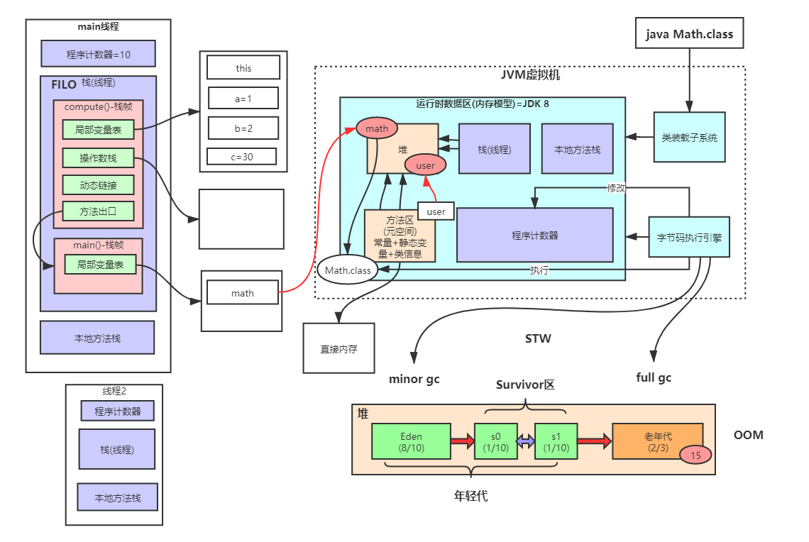
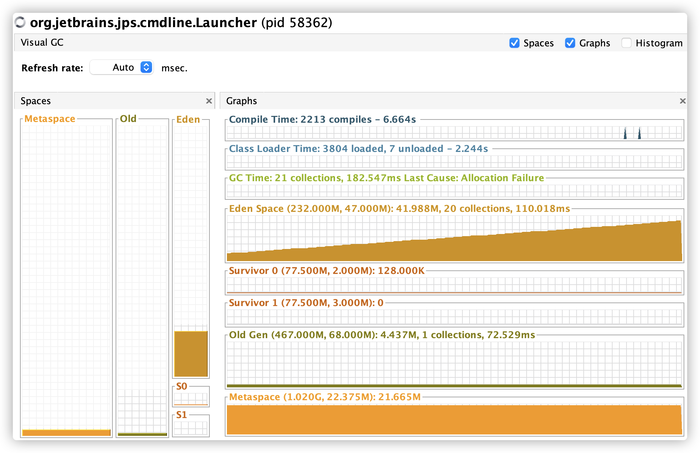

# JVM内存模型

首先来看下JAVA语言为什么是跨平台的？


1. 我们写的所有的以.java结尾的文件，经过javac编译后变成.class结尾的文件
2. 所以.class结尾的文件，都在在jvm虚拟机上面运行的
3. window，Mac，linux，都有自己版本专属的JVM虚拟机版本，所以一次编译（.class），处处运行（运行在不同版本的虚拟机上）。


## 1. JVM整体的结构及内存模型





**上图说明：**

1. **堆（heap）：** 存放着我们通过new出来的对象，以及JVM加载时为我们生成对应的Class对象（类对象）。
2. **栈：** 存放方法内部的局部变量**(如果JVM开启了逃逸分析的配置，栈帧里面有可能还会分配对象)**，会给每一个线程分配一个栈帧，JVM会给每一个方法生成一个栈（FOLO后进先出队列）一个栈帧又对应4个区域
   - 局部变量表：类似于一个table结构的数组，每一个定义的变量都会在里面。
   - 操作数栈：进行运算的一块区域，比如变量的运算，然后会赋值给局部变量表。
   - 动态链接：
   - 方法出口：记录了方法执行完毕之后，接下来要执行的代码的一个入口信息。
3. **本地方法栈：** C++的一些本地方法，调用到C++本地方法时也需要在本地方法栈内部开辟内存空间来使用。
4. **程序技术器：** 由字节码执行引擎来操作，记录多线程时，各个线程执行到代码的位置。
5. **方法区（元空间）：** 存放一些常量，静态变量以及类信息，运行时常量池


可以通过JDK自带的工具**jvisualvm**来查看JVM内存的使用情况




## 2. JVM内存参数设置

各个部分的一些简单参数设置


Spring Boot程序的JVM参数设置格式(Tomcat启动直接加在bin目录下catalina.sh文件里)：

````java
java -Xms2048M -Xmx2048M -Xmn1024M -Xss512K -XX:MetaspaceSize=256M -XX:MaxMetaspaceSize=256M -jar microservice-eureka-server.jar
````


-Xss：每个线程的栈大小（默认1M）

-Xms：设置堆的初始可用大小，默认物理内存的1/64 

-Xmx：设置堆的最大可用大小，默认物理内存的1/4

-Xmn：新生代大小

-XX:NewRatio：默认2表示新生代占年老代的1/2，占整个堆内存的1/3。

-XX:SurvivorRatio：默认8表示一个survivor区占用1/8的Eden内存，即1/10的新生代内存。

关于元空间的JVM参数有两个：-XX:MetaspaceSize=N和 -XX:MaxMetaspaceSize=N

**-XX：MaxMetaspaceSize**： 设置元空间最大值， 默认是-1， 即不限制， 或者说只受限于本地内存大小。

**-XX：MetaspaceSize**： 指定元空间触发Fullgc的初始阈值(元空间无固定初始大小)， 以字节为单位，默认是21M左右，达到该值就会触发full gc进行类型卸载， 同时收集器会对该值进行调整： 如果释放了大量的空间， 就适当降低该值； 如果释放了很少的空间， 那么在不超过-XX：MaxMetaspaceSize（如果设置了的话） 的情况下， 适当提高该值。这个跟早期jdk版本的**-XX:PermSize**参数意思不一样，-**XX:PermSize**代表永久代的初始容量。

由于调整元空间的大小需要Full GC，这是非常昂贵的操作，如果应用在启动的时候发生大量Full GC，通常都是由于永久代或元空间发生了大小调整，基于这种情况，一般建议在JVM参数中将MetaspaceSize和MaxMetaspaceSize设置成一样的值，并设置得比初始值要大，对于8G物理内存的机器来说，一般我会将这两个值都设置为256M。

**StackOverflowError**示例：

````java
public class StackOverflowError {
    static int count = 0; //count来查看，设置每个线程栈大小后，redo方法被递归了多少次才会栈溢出

    static void redo() {
        count++;
        redo();
    }

    public static void main(String[] args) {
        try {
            redo();
        } catch (Throwable t) {
            t.printStackTrace();
            System.out.println(count);
        }
    }
}

输出：
java.lang.StackOverflowError
	at com.qingfeng.jvm.StackOverflowError.redo(StackOverflowError.java:12)
	at com.qingfeng.jvm.StackOverflowError.redo(StackOverflowError.java:13)
	at com.qingfeng.jvm.StackOverflowError.redo(StackOverflowError.java:13)
````

**结论：**

-Xss设置越小count值越小，说明一个线程栈里能分配的栈帧就越少，但是对JVM整体来说能开启的线程数就会越多。