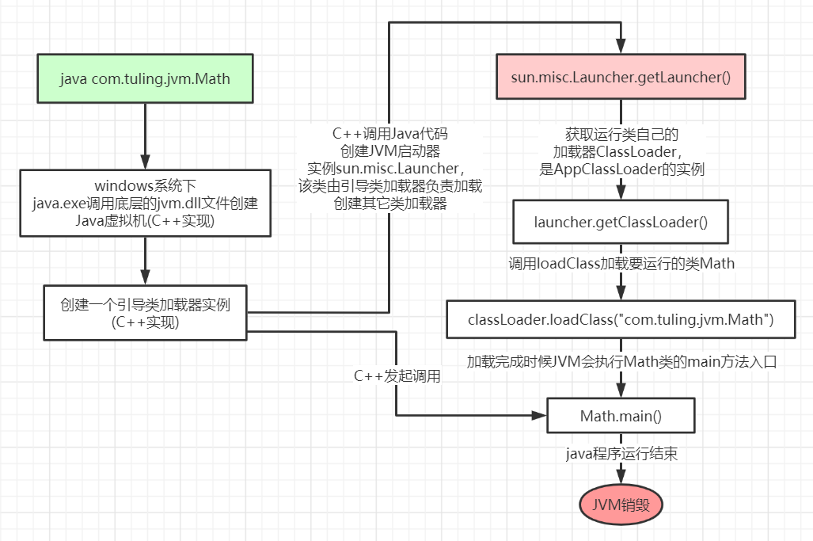

# JVM类加载机制

## 1.类加载过程

比如我们在编写如下测试代码的时候，有没有想过这个类是如何运行的呢，它在运行前都经历过哪些步骤：

````java
public class Math {
    public static final int initData = 666;
    public static User user = new User();
    public int compute() { //一个方法对应一块栈帧内存区域
        int a = 1;
        int b = 2;
        int c = (a + b) * 10;
        return c;
    }

    public static void main(String[] args) {
        Math math = new Math();
        math.compute();
    }
}
````

当我们用java命令去运行Math类的main函数启动程序的时候，首先需要通过**类加载器**把主类加载到JVM当中。



大概流程解释：

1. 一开始的是时候是由C++代码创建一个引导类加载器（BootstrapLoader）
2. C++调用Java代码创建JVM启动器实例sun.misc.Launcher这个类，该类负责创建扩展类加载器（ExtClassLoader）和应用程序类加载器（AppClassLoader）。
3. 调用getClassLoader(),这里的方法返回其实是AppClassLoader加载器
4. AppClassLoader调用父类ClassLoader的loadClass()方法加载Math类

**其中执行classLoader.loadClass("xx.xx.Math")这个方法加载要运行类的过程有下面几个步骤：**

1. **加载：** 这个过程就是在我们本地硬盘上把我们通过javac命令编译的.class文件通过IO读入字节码文件，**使用到类的时候才会加载**，例如调用类的main()方法，new对象等等，在加载阶段会在内存中生成一个代表这个类的java.lang.Class对象，作为方法区这个类的各种数据的访问入口。

2. **验证：** 就是校验字节码文件（.class）文件的正确性，例如是否以cafe babe固定格式开头等一系列的文件校验

   ````java
   //这个就是我们编写的代码编译成。class文件后的内容，
   //这个文件也有属于自己的一些格式，可以在JVM中运行
   cafe babe 0000 0034 002a 0a00 0800 2407
   0025 0a00 0200 240a 0002 0026 0700 270a
   0005 0024 0900 0200 2807 0029 0100 0869
   6e69 7444 6174 6101 0001 4901 000d 436f
   6e73 7461 6e74 5661 6c75 6503 0000 029a
   0100 0475 7365 7201 0017 4c63 6f6d 2f71
   696e 6766 656e 672f 6a76 6d2f 5573 6572
   ... //此处省略
   ````

   

3. **准备：** 给类的静态变量分配内存，并赋予默认值（默认值≠指定的值），被final修饰的直接就给成了设置值。

4. **解析：**将**符号引用**替换为直接引用，该阶段会把一些**静态方法**(符号引用，比如main()方法)替换为指向数据所存内存的指针或句柄等(直接引用)，这是所谓的**静态链接**过程(类加载期间完成)，**动态链接**是在程序运行期间完成的将符号引用替换为直接引用。（可以通过javap -v 命令来查看什么是符号引用）

   静态链接：比如静态方法。

   动态链接：比如多态形式的类，需要运行中才可以确认下来的类的实现类。

5. **初始化：** 对类的静态变量初始化为指定的值，执行静态代码块


注意：上图中只有当主类Math使用到User这个类被使用到的时候才会被加载，如果是 User user = null；那么User类将不会被加载到JVM当中。jar包和war包下面的类不是一次性全部加载的，是使用到的时候才会被加载

比如说下面这个例子：

````java
public class TestDynamicLoad {

    static {
        System.out.println("*************load TestDynamicLoad************");
    }

    public static void main(String[] args) {
        new A();
        System.out.println("*************load test************");
        B b = null;  //B不会加载，除非这里执行 new B()
    }
}

class A {
    static {
        System.out.println("*************load A************");
    }

    public A() {
        System.out.println("*************initial A************");
    }
}

class B {
    static {
        System.out.println("*************load B************");
    }

    public B() {
        System.out.println("*************initial B************");
    }
}

输出：
*************load TestDynamicLoad************  //1
*************load A************				//2
*************initial A************		//3
*************load test************		//4
````

**分析：**

1. 执行main方法，主类TestDynamicLoad被加载到了JVM当中，静态代码块会在类**初始化阶段**去执行，所以会输出上述1。
2. 执行到new A()，类A被使用，所以开始加载类A，然后执行静态代码块，输出上述2，初始化步骤类A的时候需要调用类A的无参构造方法来创建对象，所以会输出上述3.
3. 加下来执行System.out.println("*************load test************");直接输出上述4
4. B b = null;  null则认为没有使用到类B，所以类B不会被JVM加载。所以不会再有任何输出


类被加载到方法区中后主要包含 **运行时常量池、类型信息、字段信息、方法信息、类加载器的引用、对应class实例的引用**等信息。

**类加载器的引用**：这个类到类加载器实例的引用

**对应class实例的引用**：类加载器在加载类信息放到方法区中后，会创建一个对应的Class 类型的对象实例放到堆(Heap)中, 作为开发人员访问方法区中类定义的入口和切入点。


## 2.**类加载器和双亲委派机制**

上面的类加载过程其实都是通过类加载实现的，Java里有如下几种加载器：

1. **引导类加载器(BootstrapLoader)：** 负责加载支撑JVM运行的位于JRE的lib目录下的核心类库，比如rt.jar、charsets.jar等。
2. **扩展类加载器(ExtClassLoader)：** 负责加载支撑JVM运行的位于JRE的lib目录下的ext扩展目录中的JAR类包。
3. **应用程序类加载器(AppClassLoader)：** 负责加载ClassPath路径下的类包，主要就是加载自己写的那些类。
4. **自定义加载器(自己命名)：** 负责加载用户自定义路径下的类包。

看一个类加载的事例：

````java
public class TestJDKClassLoader {

    public static void main(String[] args) {
        //输出null，是因为BootstrapLoader类加载是由C++创建的，所以java根本获取不到，以下null同理
        System.out.println(String.class.getClassLoader());
        	 					System.out.println(com.sun.crypto.provider.DESKeyFactory.class.getClassLoader().getClass().getName());
        System.out.println(TestJDKClassLoader.class.getClassLoader().getClass().getName());

        System.out.println();
        ClassLoader appClassLoader = ClassLoader.getSystemClassLoader();
        ClassLoader extClassloader = appClassLoader.getParent();
        ClassLoader bootstrapLoader = extClassloader.getParent();
        System.out.println("the bootstrapLoader : " + bootstrapLoader);
        System.out.println("the extClassloader : " + extClassloader);
        System.out.println("the appClassLoader : " + appClassLoader);

        System.out.println();
        System.out.println("bootstrapLoader加载以下文件：");
        URL[] urls = Launcher.getBootstrapClassPath().getURLs();
        for (int i = 0; i < urls.length; i++) {
            System.out.println(urls[i]);
        }

        System.out.println();
        System.out.println("extClassloader加载以下文件：");
        System.out.println(System.getProperty("java.ext.dirs"));

        System.out.println();
        System.out.println("appClassLoader加载以下文件：");
        System.out.print(System.getProperty("java.class.path"));

    }
}


输出：
null
sun.misc.Launcher$ExtClassLoader
sun.misc.Launcher$AppClassLoader

the bootstrapLoader : null
the extClassloader : sun.misc.Launcher$ExtClassLoader@119d7047
the appClassLoader : sun.misc.Launcher$AppClassLoader@18b4aac2

bootstrapLoader加载以下文件：
file:/Library/Java/JavaVirtualMachines/jdk1.8.0_211.jdk/Contents/Home/jre/lib/resources.jar
file:/Library/Java/JavaVirtualMachines/jdk1.8.0_211.jdk/Contents/Home/jre/lib/rt.jar
file:/Library/Java/JavaVirtualMachines/jdk1.8.0_211.jdk/Contents/Home/jre/lib/sunrsasign.jar
file:/Library/Java/JavaVirtualMachines/jdk1.8.0_211.jdk/Contents/Home/jre/lib/jsse.jar
file:/Library/Java/JavaVirtualMachines/jdk1.8.0_211.jdk/Contents/Home/jre/lib/jce.jar
file:/Library/Java/JavaVirtualMachines/jdk1.8.0_211.jdk/Contents/Home/jre/lib/charsets.jar
file:/Library/Java/JavaVirtualMachines/jdk1.8.0_211.jdk/Contents/Home/jre/lib/jfr.jar
file:/Library/Java/JavaVirtualMachines/jdk1.8.0_211.jdk/Contents/Home/jre/classes

extClassloader加载以下文件：
/Users/qingfeng/Library/Java/Extensions:/Library/Java/JavaVirtualMachines/jdk1.8.0_211.jdk/Contents/Home/jre/lib/ext:/Library/Java/Extensions:/Network/Library/Java/Extensions:/System/Library/Java/Extensions:/usr/lib/java

appClassLoader加载以下文件：
/Library/Java/JavaVirtualMachines/jdk1.8.0_211.jdk/Contents/Home/jre/lib/charsets.jar:/Library/Java/JavaVirtualMachines/jdk1.8.0_211.jdk/Contents/Home/jre/lib/deploy.jar:/Library/Java/JavaVirtualMachines/jdk1.8.0_211.jdk/Contents/Home/jre/lib/ext/cldrdata.jar:/Library/Java/JavaVirtualMachines/jdk1.8.0_211.jdk/Contents/Home/jre/lib/ext/dnsns.jar:/Library/Java/JavaVirtualMachines/jdk1.8.0_211.jdk/Contents/Home/jre/lib/ext/jaccess.jar:/Library/Java/JavaVirtualMachines/jdk1.8.0_211.jdk/Contents/Home/jre/lib/ext/jfxrt.jar:/Library/Java/JavaVirtualMachines/jdk1.8.0_211.jdk/Contents/Home/jre/lib/ext/localedata.jar:/Library/Java/JavaVirtualMachines/jdk1.8.0_211.jdk/Contents/Home/jre/lib/ext/nashorn.jar:/Library/Java/JavaVirtualMachines/jdk1.8.0_211.jdk/Contents/Home/jre/lib/ext/sunec.jar:/Library/Java/JavaVirtualMachines/jdk1.8.0_211.jdk/Contents/Home/jre/lib/ext/sunjce_provider.jar:/Library/Java/JavaVirtualMachines/jdk1.8.0_211.jdk/Contents/Home/jre/lib/ext/sunpkcs11.jar:/Library/Java/JavaVirtualMachines/jdk1.8.0_211.jdk/Contents/Home/jre/lib/ext/zipfs.jar:/Library/Java/JavaVirtualMachines/jdk1.8.0_211.jdk/Contents/Home/jre/lib/javaws.jar:/Library/Java/JavaVirtualMachines/jdk1.8.0_211.jdk/Contents/Home/jre/lib/jce.jar:/Library/Java/JavaVirtualMachines/jdk1.8.0_211.jdk/Contents/Home/jre/lib/jfr.jar:/Library/Java/JavaVirtualMachines/jdk1.8.0_211.jdk/Contents/Home/jre/lib/jfxswt.jar:/Library/Java/JavaVirtualMachines/jdk1.8.0_211.jdk/Contents/Home/jre/lib/jsse.jar:/Library/Java/JavaVirtualMachines/jdk1.8.0_211.jdk/Contents/Home/jre/lib/management-agent.jar:/Library/Java/JavaVirtualMachines/jdk1.8.0_211.jdk/Contents/Home/jre/lib/plugin.jar:/Library/Java/JavaVirtualMachines/jdk1.8.0_211.jdk/Contents/Home/jre/lib/resources.jar:/Library/Java/JavaVirtualMachines/jdk1.8.0_211.jdk/Contents/Home/jre/lib/rt.jar:/Library/Java/JavaVirtualMachines/jdk1.8.0_211.jdk/Contents/Home/lib/ant-javafx.jar:/Library/Java/JavaVirtualMachines/jdk1.8.0_211.jdk/Contents/Home/lib/dt.jar:/Library/Java/JavaVirtualMachines/jdk1.8.0_211.jdk/Contents/Home/lib/javafx-mx.jar:/Library/Java/JavaVirtualMachines/jdk1.8.0_211.jdk/Contents/Home/lib/jconsole.jar:/Library/Java/JavaVirtualMachines/jdk1.8.0_211.jdk/Contents/Home/lib/packager.jar:/Library/Java/JavaVirtualMachines/jdk1.8.0_211.jdk/Contents/Home/lib/sa-jdi.jar:/Library/Java/JavaVirtualMachines/jdk1.8.0_211.jdk/Contents/Home/lib/tools.jar:/Users/qingfeng/idea/project/spring-boot-demo/target/classes:/Users/qingfeng/maven/repository/org/springframework/boot/spring-boot-starter-web/2.5.1/spring-boot-starter-web-2.5.1.jar:/Users/qingfeng/maven/repository/org/springframework/boot/spring-boot-starter/2.5.1/spring-boot-starter-2.5.1.jar:/Users/qingfeng/maven/repository/org/springframework/boot/spring-boot/2.5.1/spring-boot-2.5.1.jar:/Users/qingfeng/maven/repository/org/springframework/boot/spring-boot-autoconfigure/2.5.1/spring-boot-autoconfigure-2.5.1.jar:/Users/qingfeng/maven/repository/org/springframework/boot/spring-boot-starter-logging/2.5.1/spring-boot-starter-logging-2.5.1.jar:/Users/qingfeng/maven/repository/ch/qos/logback/logback-classic/1.2.3/logback-classic-1.2.3.jar:/Users/qingfeng/maven/repository/ch/qos/logback/logback-core/1.2.3/logback-core-1.2.3.jar:/Users/qingfeng/maven/repository/org/apache/logging/log4j/log4j-to-slf4j/2.14.1/log4j-to-slf4j-2.14.1.jar:/Users/qingfeng/maven/repository/org/apache/logging/log4j/log4j-api/2.14.1/log4j-api-2.14.1.jar:/Users/qingfeng/maven/repository/org/slf4j/jul-to-slf4j/1.7.30/jul-to-slf4j-1.7.30.jar:/Users/qingfeng/maven/repository/jakarta/annotation/jakarta.annotation-api/1.3.5/jakarta.annotation-api-1.3.5.jar:/Users/qingfeng/maven/repository/org/yaml/snakeyaml/1.28/snakeyaml-1.28.jar:/Users/qingfeng/maven/repository/org/springframework/boot/spring-boot-starter-json/2.5.1/spring-boot-starter-json-2.5.1.jar:/Users/qingfeng/maven/repository/com/fasterxml/jackson/core/jackson-databind/2.12.3/jackson-databind-2.12.3.jar:/Users/qingfeng/maven/repository/com/fasterxml/jackson/core/jackson-annotations/2.12.3/jackson-annotations-2.12.3.jar:/Users/qingfeng/maven/repository/com/fasterxml/jackson/core/jackson-core/2.12.3/jackson-core-2.12.3.jar:/Users/qingfeng/maven/repository/com/fasterxml/jackson/datatype/jackson-datatype-jdk8/2.12.3/jackson-datatype-jdk8-2.12.3.jar:/Users/qingfeng/maven/repository/com/fasterxml/jackson/datatype/jackson-datatype-jsr310/2.12.3/jackson-datatype-jsr310-2.12.3.jar:/Users/qingfeng/maven/repository/com/fasterxml/jackson/module/jackson-module-parameter-names/2.12.3/jackson-module-parameter-names-2.12.3.jar:/Users/qingfeng/maven/repository/org/springframework/boot/spring-boot-starter-tomcat/2.5.1/spring-boot-starter-tomcat-2.5.1.jar:/Users/qingfeng/maven/repository/org/apache/tomcat/embed/tomcat-embed-core/9.0.46/tomcat-embed-core-9.0.46.jar:/Users/qingfeng/maven/repository/org/apache/tomcat/embed/tomcat-embed-el/9.0.46/tomcat-embed-el-9.0.46.jar:/Users/qingfeng/maven/repository/org/apache/tomcat/embed/tomcat-embed-websocket/9.0.46/tomcat-embed-websocket-9.0.46.jar:/Users/qingfeng/maven/repository/org/springframework/spring-web/5.3.8/spring-web-5.3.8.jar:/Users/qingfeng/maven/repository/org/springframework/spring-beans/5.3.8/spring-beans-5.3.8.jar:/Users/qingfeng/maven/repository/org/springframework/spring-webmvc/5.3.8/spring-webmvc-5.3.8.jar:/Users/qingfeng/maven/repository/org/springframework/spring-context/5.3.8/spring-context-5.3.8.jar:/Users/qingfeng/maven/repository/org/springframework/spring-expression/5.3.8/spring-expression-5.3.8.jar:/Users/qingfeng/maven/repository/com/google/guava/guava/29.0-jre/guava-29.0-jre.jar:/Users/qingfeng/maven/repository/com/google/guava/failureaccess/1.0.1/failureaccess-1.0.1.jar:/Users/qingfeng/maven/repository/com/google/guava/listenablefuture/9999.0-empty-to-avoid-conflict-with-guava/listenablefuture-9999.0-empty-to-avoid-conflict-with-guava.jar:/Users/qingfeng/maven/repository/com/google/code/findbugs/jsr305/3.0.2/jsr305-3.0.2.jar:/Users/qingfeng/maven/repository/org/checkerframework/checker-qual/2.11.1/checker-qual-2.11.1.jar:/Users/qingfeng/maven/repository/com/google/errorprone/error_prone_annotations/2.3.4/error_prone_annotations-2.3.4.jar:/Users/qingfeng/maven/repository/com/google/j2objc/j2objc-annotations/1.3/j2objc-annotations-1.3.jar:/Users/qingfeng/maven/repository/org/springframework/boot/spring-boot-starter-aop/2.5.1/spring-boot-starter-aop-2.5.1.jar:/Users/qingfeng/maven/repository/org/springframework/spring-aop/5.3.8/spring-aop-5.3.8.jar:/Users/qingfeng/maven/repository/org/aspectj/aspectjweaver/1.9.6/aspectjweaver-1.9.6.jar:/Users/qingfeng/maven/repository/org/slf4j/slf4j-api/1.7.30/slf4j-api-1.7.30.jar:/Users/qingfeng/maven/repository/org/springframework/spring-core/5.3.8/spring-core-5.3.8.jar:/Users/qingfeng/maven/repository/org/springframework/spring-jcl/5.3.8/spring-jcl-5.3.8.jar:/Applications/开发软件/IntelliJ IDEA.app/Contents/lib/idea_rt.jar
````

**类加载的器初始化的过程：**

参见上述类运行加载的全过程图可知，其中会创建JVM启动器实例sun.misc.Launcher。

````java
//上述这行代码获取JVM使用的类加载器
ClassLoader.getSystemClassLoader();


//1.进入ClassLoader父类加载器，getSystemClassLoader()方法会调用initSystemClassLoader();
public static ClassLoader getSystemClassLoader() {
  initSystemClassLoader();
  if (scl == null) {
    return null;
  }
  SecurityManager sm = System.getSecurityManager();
  if (sm != null) {
    checkClassLoaderPermission(scl, Reflection.getCallerClass());
  }
  return scl;
}

//2.主要看sun.misc.Launcher l = sun.misc.Launcher.getLauncher();代码，会去调用Launcher类的方法，
//Launcher类的就是VM启动器实例，也会给我们创建类加载器
private static synchronized void initSystemClassLoader() {
        if (!sclSet) {
            if (scl != null)
                throw new IllegalStateException("recursive invocation");
            sun.misc.Launcher l = sun.misc.Launcher.getLauncher();
            if (l != null) {
                Throwable oops = null;
                scl = l.getClassLoader();
                //省略代码。。。
            }
            sclSet = true;
        }
    }

//3.getLauncher()方法会返回静态private static Launcher launcher = new Launcher();采用了单例模式
public class Launcher {
  private static URLStreamHandlerFactory factory = new Launcher.Factory();
  private static Launcher launcher = new Launcher();
  private static String bootClassPath = System.getProperty("sun.boot.class.path");
  private ClassLoader loader;
  private static URLStreamHandler fileHandler;

  public static Launcher getLauncher() {
    return launcher;
  }
}

//4.我们来看下new Launcher()空参构造器
public Launcher() {
  Launcher.ExtClassLoader var1;//定义一个ExtClassLoader扩展类加载器
  try {
    var1 = Launcher.ExtClassLoader.getExtClassLoader();//给扩展类加载器赋值
  } catch (IOException var10) {
    throw new InternalError("Could not create extension class loader", var10);
  }

  try {
    //这块赋值给上面的静态private ClassLoader loader;
    this.loader = Launcher.AppClassLoader.getAppClassLoader(var1);
  } catch (IOException var9) {
    throw new InternalError("Could not create application class loader", var9);
  }

	//省略其他代码
}

````

在Launcher构造方法内部，其创建了两个类加载器，分别是sun.misc.Launcher.ExtClassLoader(扩展类加载器)和sun.misc.Launcher.AppClassLoader(应用类加载器)。

JVM默认使用Launcher的getClassLoader()方法返回的类加载器AppClassLoader的实例加载我们的应用程序。


**双亲委派机制：**


**流程：**

先忽略自定义加载器

1. 首先比如的我们Math类，最先会在应用类加载器先判断有么有加载过这个类，有则直接返回，没有的话委托扩展类加载器加载。
2. 扩展类加载器先判断有么有加载过这个类，有则直接返回，没有的话委托引导类加载器。
3. 引导类加载器加载先判断有么有加载过这个类，有则直接返回，没有的话在自己的类加载路径寻找，找到加载，找不到向下退回扩展类加载器。
4. 扩展类加载器的类加载路径寻找，找到加载，找不到向下退回应用类加载器。
5. 应用类加载器在自己的类路径下找到Math类，加载返回。

**双亲委派机制说简单点就是，先找父亲加载，不行再由儿子自己加载**


我们来看下应用程序类加载器AppClassLoader加载类的双亲委派机制源码，AppClassLoader的loadClass方法最终会调用其父类ClassLoader的loadClass方法，该方法的大体逻辑如下：

1. 首先，检查一下指定名称的类是否已经加载过，如果加载过了，就不需要再加载，直接返回。
2. 如果此类没有加载过，那么，再判断一下是否有父加载器；如果有父加载器，则由父加载器加载（即调用parent.loadClass(name, false);）.或者是调用bootstrap类加载器来加载。
3. 如果父加载器及bootstrap类加载器都没有找到指定的类，那么调用当前类加载器的findClass方法来完成类加载。

````java
//ClassLoader的loadClass方法，里面实现了双亲委派机制
protected Class<?> loadClass(String name, boolean resolve)
    throws ClassNotFoundException
{
    synchronized (getClassLoadingLock(name)) {
        // 检查当前类加载器是否已经加载了该类
        Class<?> c = findLoadedClass(name);
        if (c == null) {
            long t0 = System.nanoTime();
            try {
                if (parent != null) {  //如果当前加载器父加载器不为空则委托父加载器加载该类
                    c = parent.loadClass(name, false);
                } else {  //如果当前加载器父加载器为空则委托引导类加载器加载该类
                    c = findBootstrapClassOrNull(name);
                }
            } catch (ClassNotFoundException e) {
                // ClassNotFoundException thrown if class not found
                // from the non-null parent class loader
            }

            if (c == null) {
                // If still not found, then invoke findClass in order
                // to find the class.
                long t1 = System.nanoTime();
                //都会调用URLClassLoader的findClass方法在加载器的类路径里查找并加载该类
                c = findClass(name);

                // this is the defining class loader; record the stats
                sun.misc.PerfCounter.getParentDelegationTime().addTime(t1 - t0);
                sun.misc.PerfCounter.getFindClassTime().addElapsedTimeFrom(t1);
                sun.misc.PerfCounter.getFindClasses().increment();
            }
        }
        if (resolve) {  //不会执行
            resolveClass(c);
        }
        return c;
    }
}
````


我们可以思考一下：

为什么双亲委派机制都是从底层应用程序加载器开始找，然后到引导类加载器，再然后从引导类加载器找类路径退回到应用程序类加载器，这样不是循环了两遍吗？为什么不设计直接从引导类加载器的类路径找一直到应用程序类加载器，这样子只需要一遍就可以？

因为我们写的代码一般都是在引导类加载器类路径下面，所以一开始在应用程序类加载器下面判断是否加载过，加载过就直接返回了，没有必要从引导类加载器开始，这样也保证了类只加载一次。保证了被加载类的唯一性。            


**为什么要设计双亲委派机制？**

1. 沙箱安全机制：自己写java.lang.String.class类不会被加载，这样便可以防止核心API库被随意的修改
2. 避免类的重复加载：当父亲已经加载了该类时，就没有必要子ClassLoader再加载一次，保证被加载类的唯一性

实例代码：

````java
package java.lang;


public class String {
    public static void main(String[] args) {
        System.out.println("我自己写的java.lang包下的String类");
    }
}

输出：
错误: 在类 java.lang.String 中找不到 main 方法, 请将 main 方法定义为:
   public static void main(String[] args)
否则 JavaFX 应用程序类必须扩展javafx.application.Application
````


**全盘负责委托机制：**

”全盘负责“是指当一个ClassLoader装载一个类时，除非显示的使用另外一个Classloader，那么该类所依赖的类也有当前的这个ClassLoader去加载。


## 3.自定义类加载器

自定义类加载器只需要继承 java.lang.ClassLoader 类，该类有两个核心的方法，一个是loadClass(String，boolean)，实现了双亲委派机制，还有一个方法是findClass，默认实现是空方法，所以我们自定义类加载器主要是**重写findClass方法**。

````java
public class MyClassLoaderTest {
    static class MyClassLoader extends ClassLoader {
        private String classPath;

        public MyClassLoader(String classPath) {
            this.classPath = classPath;
        }

        private byte[] loadByte(String name) throws Exception {
            name = name.replaceAll("\\.", "/");
            FileInputStream fis = new FileInputStream(classPath + "/" + name
                    + ".class");
            int len = fis.available();
            byte[] data = new byte[len];
            fis.read(data);
            fis.close();
            return data;
        }

        protected Class<?> findClass(String name) throws ClassNotFoundException {
            try {
                byte[] data = loadByte(name);
                //defineClass将一个字节数组转为Class对象，这个字节数组是class文件读取后最终的字节数组。
                return defineClass(name, data, 0, data.length);
            } catch (Exception e) {
                e.printStackTrace();
                throw new ClassNotFoundException();
            }
        }

    }

    public static void main(String args[]) throws Exception {
        //初始化自定义类加载器，会先初始化父类ClassLoader，其中会把自定义类加载器的父加载器设置为应用程序类加载器AppClassLoader
        MyClassLoader classLoader = new MyClassLoader("/Users/qingfeng/test");
        //D盘创建 test/com/tuling/jvm 几级目录，将User类的复制类User1.class丢入该目录
        Class clazz = classLoader.loadClass("com.qingfeng.jvm.User1");
        Object obj = clazz.newInstance();
        Method method = clazz.getDeclaredMethod("sout", null);
        method.invoke(obj, null);
        System.out.println(clazz.getClassLoader().getClass().getName());
    }
}

输出：
自定义的类User被加载了
com.qingfeng.jvm.MyClassLoaderTest$MyClassLoader
````

**打破双亲委派机制：**

上述说到loadClass(String，boolean)方法实现了双亲委派机制，所以打破双亲委派的话，就需要重写这个方法，来自定义自己的实现。

````java
public class MyClassLoaderTest {
    static class MyClassLoader extends ClassLoader {
        private String classPath;

        public MyClassLoader(String classPath) {
            this.classPath = classPath;
        }

        private byte[] loadByte(String name) throws Exception {
            name = name.replaceAll("\\.", "/");
            FileInputStream fis = new FileInputStream(classPath + "/" + name
                    + ".class");
            int len = fis.available();
            byte[] data = new byte[len];
            fis.read(data);
            fis.close();
            return data;
        }

        protected Class<?> findClass(String name) throws ClassNotFoundException {
            try {
                byte[] data = loadByte(name);
                //defineClass将一个字节数组转为Class对象，这个字节数组是class文件读取后最终的字节数组。
                return defineClass(name, data, 0, data.length);
            } catch (Exception e) {
                e.printStackTrace();
                throw new ClassNotFoundException();
            }
        }

        @Override
        public Class<?> loadClass(String name,boolean resolve) throws ClassNotFoundException {
            synchronized (getClassLoadingLock(name)) {
                // 首先会检查该类有没有被加载过
                Class<?> c = findLoadedClass(name);
                if (c == null) {
                    long t0 = System.nanoTime();
                    try {
                      	//如果以我们自己的包开头的，直接加载，每个类都会有个父类，Object，需要用系统的双											    亲委派
                        if (name.startsWith("com.qingfeng")) {
                            c = findClass(name);
                        } else {
                          	//其他系统包下的，需要走原来的双亲委派
                            c = this.getParent().loadClass(name);
                        }
                        //c = this.getParent().loadClass(name);
                    } catch (ClassNotFoundException e) {
                        // ClassNotFoundException thrown if class not found
                        // from the non-null parent class loader
                    }

                    if (c == null) {
                        // If still not found, then invoke findClass in order
                        // to find the class.
                        long t1 = System.nanoTime();
                        c = findClass(name);

                        // this is the defining class loader; record the stats
                        sun.misc.PerfCounter.getParentDelegationTime().addTime(t1 - t0);
                        sun.misc.PerfCounter.getFindClassTime().addElapsedTimeFrom(t1);
                        sun.misc.PerfCounter.getFindClasses().increment();
                    }
                }
                if (resolve) {
                    resolveClass(c);
                }
                return c;
            }
        }
    }

    public static void main(String args[]) throws Exception {
        //初始化自定义类加载器，会先初始化父类ClassLoader，其中会把自定义类加载器的父加载器设置为应用程序类加载器AppClassLoader
        MyClassLoader classLoader = new MyClassLoader("/Users/qingfeng/test");
        //D盘创建 test/com/tuling/jvm 几级目录，将User类的复制类User1.class丢入该目录
        //Class clazz = classLoader.loadClass("com.qingfeng.jvm.User1");
        Class clazz = classLoader.loadClass("com.qingfeng.jvm.User1");
        Object obj = clazz.newInstance();
        Method method = clazz.getDeclaredMethod("sout", null);
        method.invoke(obj, null);
        System.out.println(clazz.getClassLoader().getClass().getName());

        System.out.println("------------------------------");

        //初始化自定义类加载器，会先初始化父类ClassLoader，其中会把自定义类加载器的父加载器设置为应用程序类加载器AppClassLoader
        MyClassLoader classLoader01 = new MyClassLoader("/Users/qingfeng/test1");
        //D盘创建 test/com/tuling/jvm 几级目录，将User类的复制类User1.class丢入该目录
        //Class clazz = classLoader.loadClass("com.qingfeng.jvm.User1");
        Class clazz01 = classLoader01.loadClass("com.qingfeng.jvm.User1");
        Object obj01 = clazz01.newInstance();
        Method method01 = clazz01.getDeclaredMethod("sout", null);
        method01.invoke(obj01, null);
        System.out.println(clazz.getClassLoader().getClass().getName());
    }
}

````


**Tomcat打破双亲委派机制**

以Tomcat类加载为例，Tomcat 如果使用默认的双亲委派类加载机制行不行？

我们思考一下：Tomcat是个web容器， 那么它要解决什么问题： 

1. 一个web容器可能需要部署两个应用程序，不同的应用程序可能会**依赖同一个第三方类库的不同版本**，不能要求同一个类库在同一个服务器只有一份，因此要保证每个应用程序的类库都是独立的，保证相互隔离。 

2. 部署在同一个web容器中**相同的类库相同的版本可以共享**。否则，如果服务器有10个应用程序，那么要有10份相同的类库加载进虚拟机。 

3. **web容器也有自己依赖的类库，不能与应用程序的类库混淆**。基于安全考虑，应该让容器的类库和程序的类库隔离开来。 

4. web容器要支持jsp的修改，我们知道，jsp 文件最终也是要编译成class文件才能在虚拟机中运行，但程序运行后修改jsp已经是司空见惯的事情， web容器需要支持 jsp 修改后不用重启。

再看看我们的问题：**Tomcat 如果使用默认的双亲委派类加载机制行不行？** 

答案是不行的。为什么？

第一个问题，如果使用默认的类加载器机制，那么是无法加载两个相同类库的不同版本的，默认的类加器是不管你是什么版本的，只在乎你的全限定类名，并且只有一份。

第二个问题，默认的类加载器是能够实现的，因为他的职责就是保证**唯一性**。

第三个问题和第一个问题一样。

我们再看第四个问题，我们想我们要怎么实现jsp文件的热加载，jsp 文件其实也就是class文件，那么如果修改了，但类名还是一样，类加载器会直接取方法区中已经存在的，修改后的jsp是不会重新加载的。那么怎么办呢？我们可以直接卸载掉这jsp文件的类加载器，所以你应该想到了，每个jsp文件对应一个唯一的类加载器，当一个jsp文件修改了，就直接卸载这个jsp类加载器。重新创建类加载器，重新加载jsp文件。

**Tomcat自定义加载器详解**


tomcat的几个主要类加载器：

- commonLoader：Tomcat最基本的类加载器，加载路径中的class可以被Tomcat容器本身以及各个Webapp访问；
- catalinaLoader：Tomcat容器私有的类加载器，加载路径中的class对于Webapp不可见；
- sharedLoader：各个Webapp共享的类加载器，加载路径中的class对于所有Webapp可见，但是对于Tomcat容器不可见；
- WebappClassLoader：各个Webapp私有的类加载器，加载路径中的class只对当前Webapp可见，比如加载war包里相关的类，每个war包应用都有自己的WebappClassLoader，实现相互隔离，比如不同war包应用引入了不同的spring版本，这样实现就能加载各自的spring版本；

从图中的委派关系中可以看出：

CommonClassLoader能加载的类都可以被CatalinaClassLoader和SharedClassLoader使用，从而实现了公有类库的共用，而CatalinaClassLoader和SharedClassLoader自己能加载的类则与对方相互隔离。

WebAppClassLoader可以使用SharedClassLoader加载到的类，但各个WebAppClassLoader实例之间相互隔离。

而JasperLoader的加载范围仅仅是这个JSP文件所编译出来的那一个.Class文件，它出现的目的就是为了被丢弃：当Web容器检测到JSP文件被修改时，会替换掉目前的JasperLoader的实例，并通过再建立一个新的Jsp类加载器来实现JSP文件的热加载功能。

tomcat 这种类加载机制违背了java 推荐的双亲委派模型了吗？答案是：违背了。 

很显然，tomcat 不是这样实现，tomcat 为了实现隔离性，没有遵守这个约定，**每个webappClassLoader加载自己的目录下的class文件，不会传递给父类加载器，打破了双亲委派机制**。


**模拟实现Tomcat的JasperLoader热加载**

原理：后台启动线程监听jsp文件变化，如果变化了找到该jsp对应的servlet类的加载器引用(gcroot)，重新生成新的**JasperLoader**加载器赋值给引用，然后加载新的jsp对应的servlet类，之前的那个加载器因为没有gcroot引用了，下一次gc的时候会被销毁。