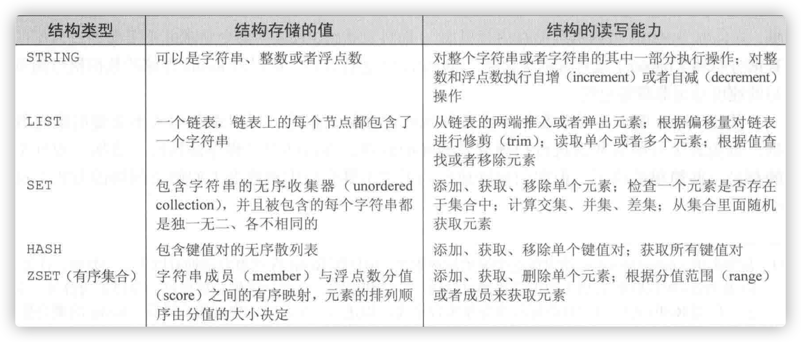
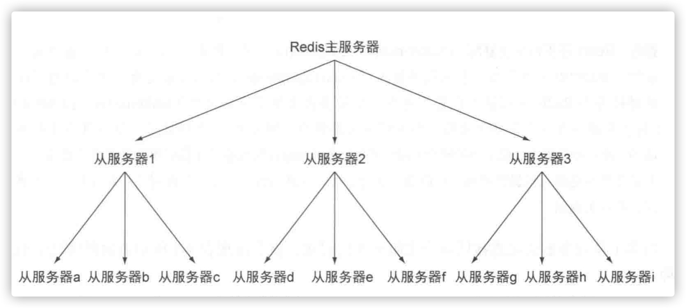

# Redis简介

Redis是一个通过C语言编写的基于内存处理速度非常快的**非关系型数据库**，它可以存储键（key）与5种不同类型的值（value）之间的映射，可以将存储在内存的键值对数据持久化到磁盘，可以使用复制特性来扩展读的性能，还可以使用客户端分片来扩展写的性能。接下里我们逐一介绍

> 分片：分片是一种将数据划分为多个部分的方法，对数据的划分可以基于键包含的ID，基于键的散列值，或者基于以上两种的某种组合，通过对数据进行分片，用户可以将数据存储到多台机器里面，也可以从多台机器里面获取到数据，这种方法在解决某些问题时可以获得线性级别的性能提升

## 一、Redis基本介绍

### 1.Redis的5中数据结构



#### String（字符串）

操作字符串的一个简单的基本命令

| 命令 | 行为                                                 |
| ---- | ---------------------------------------------------- |
| get  | 获取存储在给定键中的值                               |
| set  | 设置存储在给定键中的值                               |
| del  | 删除存储在给定键中的值（这个命令可以用于所有的类型） |

以下是在redis-cli中对于字符串操作的基本命令

````java
127.0.0.1:6379> set hello world
OK
127.0.0.1:6379> get hello
"world"
127.0.0.1:6379> del hello
(integer) 1
127.0.0.1:6379> get hello
(nil)
````

**应用场景：**

1. string类型是二进制安全的。意思是redis的string可以包含任何数据。比如jpg图片或者序列化的对象，将数据以二进制序列化的方式进行存储

2. 由于对于value可以进行INCR命令自增自减，所以可以作为一个访问量的统计（文章，博客，登录次数限制）

   

#### List（列表-链表）

一个列表结构可以存储多个字符串，列表里面的元素是可以重复的，有序，类似于我们java中的List集合概念

| 命令   | 行为                                     |
| ------ | ---------------------------------------- |
| rpush  | 将给定的值推入到列表的右端               |
| lrange | 获取列表在给定范围上的所有值             |
| lindex | 获取列表在给定位置上的单个元素           |
| lpop   | 从列表的左端弹出一个值，并返回被弹出的值 |

以下是在redis-cli中对于字符串操作的基本命令

````java
127.0.0.1:6379> rpush key item1
(integer) 1
127.0.0.1:6379> rpush key item2
(integer) 2
127.0.0.1:6379> rpush key item1
(integer) 3
127.0.0.1:6379> lrange key 0 -1
1) "item1"
2) "item2"
3) "item1"
127.0.0.1:6379> lindex key 2 //根据索引拿元素
"item1"
127.0.0.1:6379> lindex key 3
(nil)
127.0.0.1:6379> lindex key 2
"item1"
127.0.0.1:6379> lpop key //从列表左边弹出元素，并获取该元素，类似于删除
"item1"
127.0.0.1:6379> lrange key 0 -1 //元素"item1"已经被弹出，所以在此获取所有元素只剩下2个
1) "item2"
2) "item1"
````

操作列表的元素的redis命令可不止这些。。。

**应用场景**：

1. 基于右进左出，最新消息的一个排行（比如微信朋友圈的时间线）
2. 消息队列

#### set（集合）

一个集合结构可以存储多个字符串，集合里面的元素是不可以重复的，无序，类似于我们java中的set集合概念，redis通过散列值来保证自己存储的每个字符串都是各不相同的

| 命令      | 行为                                         |
| --------- | -------------------------------------------- |
| sadd      | 将给定元素添加到集合                         |
| smembers  | 返回集合包含的所有元素                       |
| sismember | 检查给定元素是否存在于集合中                 |
| srem      | 如果给定的元素存在于集合中，那么移除这个元素 |

````java
127.0.0.1:6379> sadd set item1
(integer) 1
127.0.0.1:6379> sadd set item2
(integer) 1
127.0.0.1:6379> sadd set item3
(integer) 1
127.0.0.1:6379> sadd set item1 
(integer) 0
127.0.0.1:6379> smembers set
1) "item2"
2) "item3"
3) "item1"
127.0.0.1:6379> sismember set item1
(integer) 1
127.0.0.1:6379> sismember set item0
(integer) 0
127.0.0.1:6379> srem set item item1
(integer) 1
127.0.0.1:6379> srem set item item1
(integer) 0
127.0.0.1:6379> smembers set
1) "item2"
2) "item3"
````

**应用场景：**

1. 共同好友
2. 利用唯一性，统计访问网站的所有的独立IP

#### Hash（散列）

Redis的散列可以存储多个键值对之间的映射，和字符串一样，散列存储的值即可以是字符串也可以是数字，同样可以对散列存储的数字执行自增自减的操作操作。

| 命令    | 行为                                     |
| ------- | ---------------------------------------- |
| hset    | 在散列里面关联起给定的键值对             |
| hget    | 获取指定散列值的键                       |
| hgetall | 获取散列值包含的所有键值对               |
| hdel    | 如果给定键存在于散列里面，那么移除这个键 |


````java
127.0.0.1:6379> hset hash key1 value1
(integer) 1
127.0.0.1:6379> hset hash key2 value2
(integer) 1
127.0.0.1:6379> hset hash key1 value2
(integer) 0
127.0.0.1:6379> hset hash key2 value2
(integer) 0
127.0.0.1:6379> hgetall hash
1) "key1"
2) "value2"
3) "key2"
4) "value2"
127.0.0.1:6379> hdel hash key1
(integer) 1
127.0.0.1:6379> hdel hash key1
(integer) 0
127.0.0.1:6379> hgetall hash
1) "key2"
2) "value2"
````


**应用场景：**

1. 一个用户属性的一些存储，读取

#### Zset（有序集合）

有序集合和散列一样，都用于存储键值对，有序集合的键被称为成员（number），每个成员值都是各不相同，而值被称为分值（score），分值必须为浮点数。有序是redis唯一一个既可以根据成员访问元素，又可以根据分值以及分值的排列顺序来访问元素的结构

| 命令         | 行为                                                         |
| ------------ | ------------------------------------------------------------ |
| zadd         | 将一个带有定分值的成员添加到有序集合里面                     |
| zrange       | 根据元素在有序排列中所处的位置，从有序集合里面获取多少个元素 |
| zrangbyscore | 获取有序集合在给定分值范围内的所有元素                       |
| zrem         | 如果给定成员存在于有序集合中，那么移除这个成员               |


````java
127.0.0.1:6379> zadd zset 678 number1
(integer) 1
127.0.0.1:6379> zadd zset 123 number3
(integer) 1
127.0.0.1:6379> zadd zset 23 number4
(integer) 1
127.0.0.1:6379> zrange zset 0 -1
1) "number4"
2) "number3"a
3) "number1"
127.0.0.1:6379> zrange zset 0 -1 withscores
1) "number4"
2) "23"
3) "number3"
4) "123"
5) "number1"
6) "678"
127.0.0.1:6379> zrem zset number1
(integer) 1
127.0.0.1:6379> zrange zset 0 -1 withscores
1) "number4"
2) "23"
3) "number3"
4) "123"
127.0.0.1:6379> zrangebyscore zset 0 10000
1) "number3"
2) "number2"
127.0.0.1:6379> zrangebyscore zset 100 10000 withscores
1) "number3"
2) "123"
3) "number2"
4) "678"
````

**应用场景：**

1. 带权重的消息队列
2. 排行榜，去topN的操作

总结：

1. String存储的就是简单的字符串
2. list可以存储多个元素，有序，可重复，可以在左右进行元素操作
3. set可以存储多个元素，无序，不可重复
4. hash存储的是键值对，无序
5. zset存储的也是键值对，根据scroe分值确定顺序

### 2.发布/订阅

一般来说发布/订阅（又称pub/sub）的特点是订阅者（listener）负责订阅频道（channel），发送者（publisher）负责向频道发送二进制字符串消息。每当有消息被发送至给定频道时，频道的所有订阅者都会收到消息，我们也可以把频道看做是电台，其中订阅者可以同时收听多个电台，而发送者则可以在任何电台发送消息。

| 命令         | 行为                                                         |
| ------------ | ------------------------------------------------------------ |
| subscribe    | subscribe channel  [channel ...]------订阅给定的一个或多个频道 |
| unsubscribe  | unsubscribe [channel  [channel ...]]-------退订给定的一个或多个频道，如果执行时没有有给定任何频道，那么退订所有频道 |
| publish      | publish    channel  message --------向给定频道发送消息       |
| psubscribe   | psubscribe   pattern   [pattern  ....] ------订阅与给定模式相匹配的所有频道 |
| punsubscribe | punsubscribe   [pattern   [pattern  ....]] ------退订给定模式，如果执行时没有给定任何模式，那么退订所有模式 |

问题：

1. 虽然可以自动断开不符合client-out-put-buffer-limit pubsub配置选项要求的订阅客户端，但是如果一个客户端订阅了某些频道，但是读取消息的速度不够快的话，那么会就在频道当中产生消息积压，会使得Redis输出缓冲区的体积变大，间接导致redis速度过慢，甚至直接崩溃。
2. 网络原因导致客户端执行订阅操作的过程中断线，那么就会丢失断线期间的发送的所有数据。


### 3.Redis事务

Redis有5个命令可以让用户在不被打断的情况下对多个键执行操作，它们分别是watch， multi，exec，unwatch。

redis的基本事务需要用到需要用到multi，exec命令，这种事务可以让一个客户端在不被其他客户端打断的情况下执行多个命令，和关系型数据库那种可以在执行过程中回滚的事务不同，在redis里，被multi，exec命令包裹的所有命令会一个接一个的去执行，直到所有的命令都执行完毕。当一个事务执行完毕之后，redis才会去处理其他客户端的命令。

````java
127.0.0.1:6379> multi
127.0.0.1:6379> 命令1
127.0.0.1:6379> 命令2
127.0.0.1:6379> 命令3
127.0.0.1:6379> exec
````

当redis从一个客户端哪里接收到multi命令时，Redis会将这个客户端之后发送的所有命令都放入到一个队列里面，直到这个客户端发送exec命令为止，然后Redis在不被打断的情况下，一个接着一个地执行存储在队列里面的命令。

### 4.键的过期时间

使用redis的时候虽然我们可以用命令del显式的删除一些无用的数据，也可以通过Redis的过期时间（expiration）特性来让一个键在给定的时限之后自动的被删除。

| 命令     | 行为                                                         |
| -------- | ------------------------------------------------------------ |
| persist  | persist  key-name  ---移除键的过期时间                       |
| ttl      | ttl   key-name  ----查看给定的键距离过期还有多少秒           |
| expire   | expire  key-name   seconds  ----让给定键在指定的秒数之后过期 |
| expireat | expireat  key-name  timestamp  ---将给定键的过期时间设置为给定的UNIX时间戳 |

## 二、数据安全

### 1.持久化

Redis提供了两种不同的持久化方法来将数据存储到硬盘里面。

快照：它可以将存储于某一时刻的所有数据都写入硬盘里面

只追加文件（AOF）：它会在执行写的命令的时候，将被执行的写命令复制到硬盘里面。

这两种持久化方法既可以同时使用，又可以单独使用，甚至可以两种方法都不用。

持久化的主要原因就是为了在之后重用数据，或者为了防止redis因为故障宕机而将数据保存在硬盘上。

#### 快照持久化（RDB）

redis通过创建快照来获得存储在内存里面的数据在**某个时间点上**的副本，之后快照可以被备份，或者复制到其他服务器获取相同的数据，可以留在本地以便服务器重启时使用。

根据配置，快照将被写入到dbfilename选项指定的文件里面，并存储在dir选项指定的路径上面，如果新的快照文件创建完毕之前，redis服务器崩溃，那么将丢失最近一次创建快照之后写入的所有数据。举个例子：


> 假设Redis里面存储了10GB的数据，上一个快照是下午2：03分开始创建的，并创建成功了。下午3：06分又开始创建新的快照，并且在下午3：10分快照文件创建完毕之前，有40个key进行了更新。如果在下午3：06到3：10之间，系统发生了崩溃，那么redis将丢失下午2：03之后写入的所有数据。
>
> 另一个方面：如果系统恰好在新的快照文件创建完毕之后崩溃了，那么redis将只会丢失40个key的更新数据


**创建快照的几种方法：**

1. 客户端可以通过向Redis发送bgsave命令来创建一个快照，redis会调用fork来创建一个子进程，子进程负责将快照写入硬盘，父进程继续处理命令请求
2. 客户端可以通过redis发送save命令来创建一个快照，接到save命令的redis服务器在快照创建结束之前将不再响应其他任何命令，类似于阻塞的一个状态。
3. 用户设置save配置选项，例如：save 60  500，那么从redis最近一次创建快照之后开始起算，当"60秒之内有500次的写入操作"这个条件满足时，redis就会自动触发bgsave命令。如果用户设置多了save配置选项，当任意一个配置选项被满足时，redis就会触发一次bgsave。
4. 当redis通过shutdown命令接收到关闭服务器的请求时，会执行一个save的命令，阻塞所有客户端，不再执行客户端发送的任何命令，并在save命令执行完毕后关闭服务器。
5. 当redis服务器连接另外一个redis服务器，并向对方发送sync命令来开始一次复制操作时，如果主服务器目前没有在执行bgsave的操作，或者主服务器并非刚刚执行完bgsave操作，那么主服务器就会执行bgsave命令

> 在只用RDB快照持久化来保存数据的时候，如果系统发生崩溃，用户将会丢失最近一次生成快照之后的所有数据，所以，RDB快照只适合即使丢失一部分数据也不会造成影响的应用场景。

````xml
# redis.conf

# 快照文件名
dbfilename dump.rdb 
#文件存放路径
dir ./
````


问题：

如果redis占用的内存小的的话这个方式将会是一种不错的选择，如果redis占用的内存高达十几个G的话，并且剩余的空闲内存并不多，bgsave在创建子进程时耗时的时间也会越来越多，可能会导致服务长时间的停顿，所以我们可以关闭自动自动保存，转而使用手动bgsave或者save命令去保存，如果内存占用大话，相对的使用save会比bgsave速度还要快，虽然它会一直阻塞知道快照完成，但是它不需要创建子进程

#### 只追加文件（AOF)

简单来说，AOF持久化会将被执行的写的命令写到AOF文件的末尾，以此来记录数据发生的变化，因此，redis只需要从头到尾重新执行一次AOF文件所包含的写的命令，就可以恢复AOF文件所记录的数据集。

向硬盘写入文件时：

1. 当调用file.write()方法时对文件进行写入时，写入的内容首先会被存储到缓冲区，然后操作系统会决定何时将缓冲区的存储的内容写入到硬盘
2. 用户可以调用file.flush()方法来请求操作系统尽快的将缓冲区存储的数据写入到硬盘，但是具体何时执行，还是操作系统决定。
3. 用户还可以命令操作系统将文件同步（sync）到硬盘，同步操作会一直阻塞直到指定的文件被写入到硬盘为止，当同步操作执行完毕之后，即使系统出现故障也不会对被同步的文件造成任何影响。

````java
# AOF持久化机制配置信息  
# always -- 每个redis写命令都要同步写入硬盘
# everysec -- 每秒执行一次同步,显式的将多个写命令同步到硬盘
# no -- 让操作系统来决定应该何时进行同步
appendonly no
````

问题：

单看上面的介绍的话，AOF持久化既可以将丢失数据的时间窗口降低至1秒，又可以在极端的时间内完成定期的持久化操作，那么我们有什么理由不使用AOF持久化呢？但是这个问题实际是没有那么简单的，因为redis会不断的将被执行的命令记录到AOF文件当中，随着redis不断运行，AOF文件的体积也在不断增大，在极端情况下，AOF文件甚至可能用完硬盘的所有空间，还有一个问题就是，redis重启之后需要重新执行AOF文件来还原数据集，所以如果AOF文件体积过大，那么还原操作的执行时间就可能会很长。

为了解决上述问题，用户可以向redis发送bgrewriteaof命令，这个命令会通过移除AOF文件中的冗余命令来重写AOF文件，使得AOF文件体积变得尽可能的小，bgrewriteaof命令的工作原理和bgsave命令原理非常相似，redis会创建一个子进程，然后由子进程负责对AOF文件进行重写。所以快照持久化因为子进程而导致的性能问题，在AOF持久化机制当中也会存在的。

````java
//redis.conf配置
auto-aof-rewrite-percentage 100 
auto-aof-rewrite-min-size 64mb
````

举个例子：

假设用户对redis配置了如上两个选项，并且启用了AOF持久化机制，那么当AOF文件的体积大于64M，并且AOF文件的体积比上一次重写之后的体积大于至少一倍（100%）的时候，redis将执行bgrewriteaof命令。

### 2.复制

无论是使用AOF持久化还是RDB持久化，将数据保存到硬盘上是非常有必要的，但是除了前面两点之外，我们还需要对持久化所得的文件进行备份，可以的话最好将持久化文件备份到不同的服务器上面去。

复制可以让其他服务器拥有一个不断更新的数据副本，从而使得拥有数据副本的服务器可以用于处理客户端发送的读请求，redis通过使用一个主服务器（master）向多个从服务器（slave）发送更新，并使用从服务器来处理读请求来实现自己复制的特性。


当从服务器连接主服务器的时候，主服务器会执行bgsave操作，因此为了正确的使用复制的特性，用户需要保证主服务器配置了dir和dbfliename选项。

如果用户在启动redis服务器的时候，添加指定了一个包含slaveof  host  port选项的配置文件，那么redis服务器将根据该选项给定的ip地址和端口号来连接主服务器，对于一个正在运行的redis服务器，用户可以通过发送slaveof  no one 命令来让服务器终止复制操作，不再接受主服务器的数据，也可以通过发送slaveof  host port命令来服务器开始复制一个新的主服务器。

#### 1.redis的复制的启动过程

| 步骤 | 主服务操作                                                   | 从服务器操作                                                 |
| ---- | ------------------------------------------------------------ | ------------------------------------------------------------ |
| 1    | 等待命令进入                                                 | 连接（或重试连接）主服务器，发送sync命令                     |
| 2    | 开始执行bgsave，并使用缓冲区记录bgsave之后执行的所有写命令   | 根据配置文件来决定是继续使用现有的数据（如果有的话）来处理客户端的请求，还是向发送请求的客户端返回错误 |
| 3    | bgsave执行完毕，向从服务器发送快照文件，并在发送期间继续使用缓冲区记录被执行的写命令 | 丢弃所有的旧数据（如果有的话），开始载入主服务器发来的快照文件 |
| 4    | 快照文件发送完毕，开始向服务器发送存储在缓冲区里面的写命令   | 完成对快照文件的解释操作，像往常一样开始接受命令请求         |
| 5    | 缓冲区存储的写命令发送完毕后；从现在开始，每执行一个写命令，就向服务器发送相同的写命令 | 执行主服务器发来的所有存储在缓冲区里面的写命令；从现在开始，接收并执行主服务器传来的每个写命令 |

**设置从服务器的方法：**

1. 可以通过配置选项slaveof  host  port将一个redis服务器设置为从服务器，reids在启动时首先会载入当前可用的任何快照文件或者AOF文件，然后连接主服务器并执行上述表格的复制过程
2. 可以通过向运行中的redis服务器发送slaveof命令来将其设置为从服务器，redis会立即尝试连接主服务器，并在连接成功之后开始上述表格的步骤

**注意：**

当有新的从服务器连接主服务器时，如果主服务没有正在和其他从服务器进行复制的话，那么主服务器会执行上述表格1~5的步骤，如果主服务器正在和较早连接的从服务器进行复制的话，那么等待上述5个步骤执行完，主服务器才会和新的从服务器执行一次新的5个步骤

#### 2.主从链

从服务器也可以拥有自己的从服务器，并由此形成主从链

从服务器对从服务器进行复制的操作上和从服务器对主服务进行复制的唯一区别在于，如果从服务器X拥有从服务器Y，那么当从服务器X在执行上上述表格步骤4的时候，它将断开与从服务器Y的连接，导致从服务器Y需要重新连接并重新同步。



当读请求明显对于写请求的时候，并且读请求远超出一台redis服务器可以处理的范围内时，用户就需要添加新的从服务器来处理读请求。为了将数据保存到多台机器上面，首先需要为主服务器设置多个从服务器，然后对每个从服务器设置appendonly  yes选项和appendsync  yes选项（如果有需要的话，也可以对主服务器进行相同的设计），这样的话，用户就可以让多台服务器以每秒的频率将数据同步到硬盘了。但是因为用户还必须等待主服务器发送写的命令到达从服务器，并在在执行后续操作之前，检查数据是否已经被同步到了硬盘里面

#### 3.检验硬盘写入

可以使用info命令的输出结果中aof_pending_bio_fsync属性的值是否为0，如果是的话，那么就表示服务器已经将已知的所有数据都保存到硬盘里面了。info命令提供了大量的与redis服务器当前状态信息有关，比如，内存占用量，客户端连接数，每个数据库包含的键的数量等等

#### 4.更换故障主服务器

假设A,B两台机器都运行着Redis，其中A机器为主服务器，B机器是从服务器，不巧的是A机器故障了，因此用户决定使用C机器用作新的主服务器：首先向B机器发送一个save命令，让他创建一个新的快照文件，接着将这个新的快照文件发送给C，并在机器C上面启动redis，最后让B机器成为C的从服务器。

### 3.管道


​	

## 三、分布式锁

***分布式锁本质：就是在所有进程都能够访问到的地方，设置一个锁资源，让这些进程都来竞争所资源***

为了对数据进行排他性的访问，程序首先要做的就是获取锁，可以使用setnx命令

> setnx命令天生就适合来实现锁的获取功能，这个命令只会在键不存在的情况下为键设置值，如果key不存在就设置值value返回1，如果存在直接返回0
>
> - *setNX指令，如果key不存在就设置值value返回1，如果存在直接返回0*
> - *setEX指令，将值 value 关联到 key ，并将 key 的生存时间设为 seconds (以秒为单位)。如果 key 已经存在，setex命令将覆写旧值。*
> - *getset指令：先get，再set，先返回key对应的值，如果没有就返回空，然后再将key设置成value*


```java
public boolean tryLock(Jedis jedis) {
   String uuid = UUID.randomUUID().toString();
    //1.直接从reid中获取key为"myKey"的,存在返回0,不存在设置上值并返回1
    if (jedis.setnx("myKey", uuid) == 1) {
        //拿到锁
        return true;
    } else {
        return false;
    }
    //释放锁 DEL 
}
```

上述方案中，setnx用于加锁，del用于解锁，那么问题来了：目前持有锁的进程如果崩溃了或者获取到锁的进程执行失败，那么这将导致锁一直处于已被获取转换台，它就永远不会主动解锁，那这个锁就会被锁死了，为了解决这个问题，下面我们将为锁加上超时时间，即使线程挂了，我们设置过期时间后，他也会自动释放锁：

```java
    public boolean tryLock(Jedis jedis) {
        final String KEY = "myKey";
        //1.直接从reid中获取key为"myKey"的,存在返回0,不存在设置上并返回1
        if (jedis.setnx(KEY, "1") == 1) {
            //拿到锁,并且设置过期时间
            jedis.expire(KEY, 1000);
            return true;
        } else {
            return false;
        }
        //释放锁 DEL
    }
```

对于上述解决方案，已经算是差不多完美了，但是我们除了要考虑代码问题，还要考虑redis的本身问题，目前存在的问题是：setnx和expire并不是原子性的，所以获取锁的进程有可能还没有执行expire指令，就挂了，这时候还会被锁死，那我们就setnx获取锁失败的时候，拿这个过期时间跟当前时间对比，如果是过期时间的锁，就先删除锁，再重新上锁（redis中setEX指令是设置值并添加过期时间)

在高并发场景下，有可能多个线程同时都能进入到oldVal不为空的判断，会产生多个线程同时拿到锁的情况

setNX失败后，获取锁上的时间戳，然后用getset，将自己的过期时间更新上去，并获取旧值，如果这个旧值，跟之前获取得时间戳是不一致的，就表示这个锁已经被其他进程占用了，自己就要放弃竞争锁

```java
public boolean tryLock(Jedis jedis) {

        //key值
        final String KEY = "myKey";
        //获取系统当前时间
        long nowTime = System.currentTimeMillis();
        //过期时间
        long expireTime = nowTime + 1000;

        //1.直接从reid中获取key为"myKey"的,存在返回0,不存在设置上并返回1
        if (jedis.setnx(KEY, Long.toString(expireTime)) == 1) {
            //拿到锁,并且设置过期时间
            jedis.expire(KEY, 1000);
            return true;
        } else {
            //如果没有拿到锁,获取该所的旧值,比对当前时间
            String oldVal = jedis.get(KEY);
            //如果拿到的锁时间小于设置的锁时间,证明已经过期
            if (Objects.isNull(oldVal) && Long.getLong(oldVal) <nowTime){
                String nowVal = jedis.getSet(KEY, Long.toString(expireTime));
                //如果拿到旧值和新加设置的是一样的,拿到该锁
                if (oldVal == nowVal){
                    jedis.expire(KEY, 1000);
                    return true;
                }
                return false;
            }
            return false;
        }
        //释放锁 DEL
    }
```

还一种解决方案就是将以上的某些操作通过lua脚本去实现。


::: tip 声明 
本文参考redis实战书籍
:::

